```{r setup, include=FALSE, message=FALSE}
library(ggplot2)
knitr::opts_chunk$set(echo = FALSE)
```

# Question 1  
## a.  
```{r Question1}
```

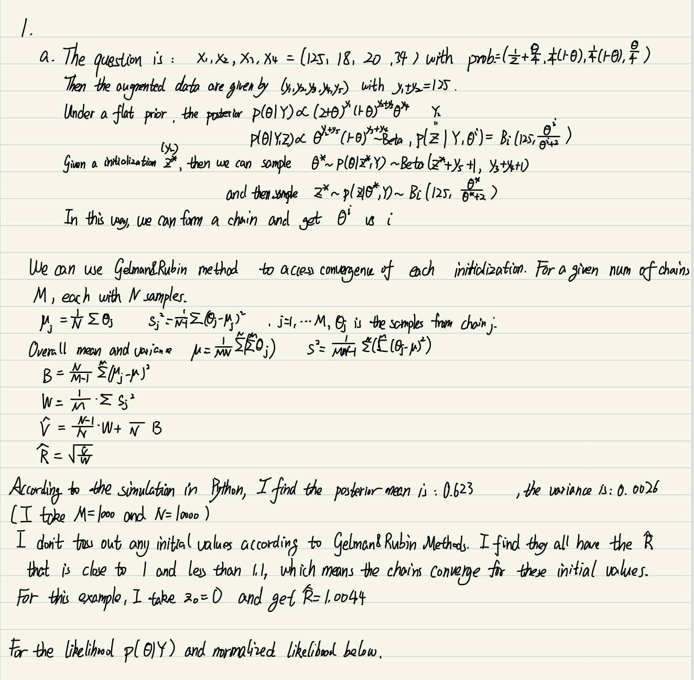
(For the emergent environmental problem, I have to move the codes to R from Python).  
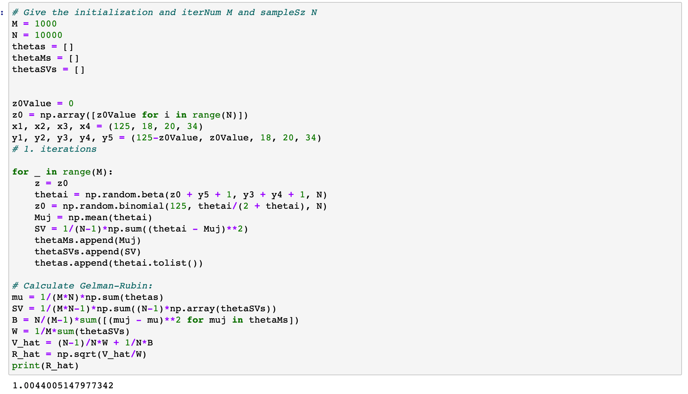
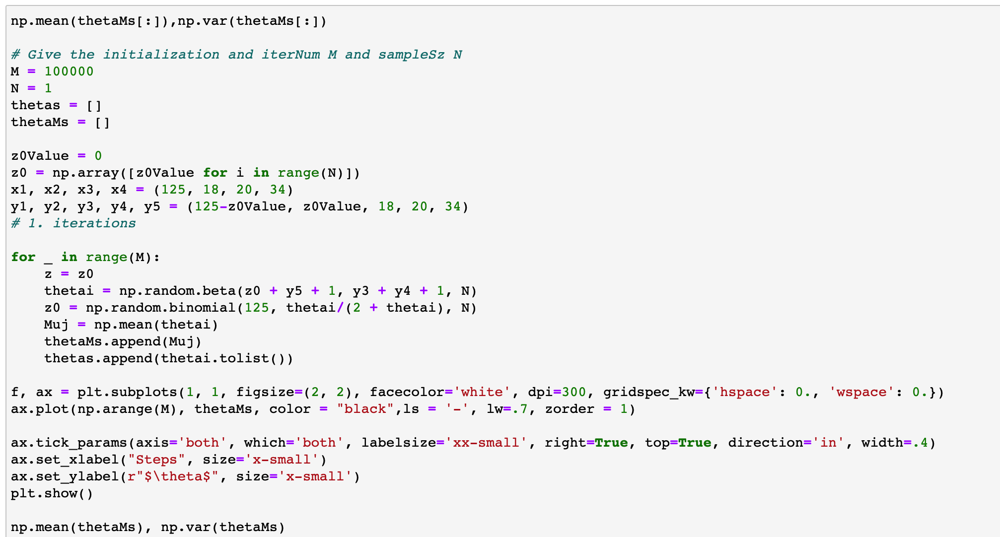  
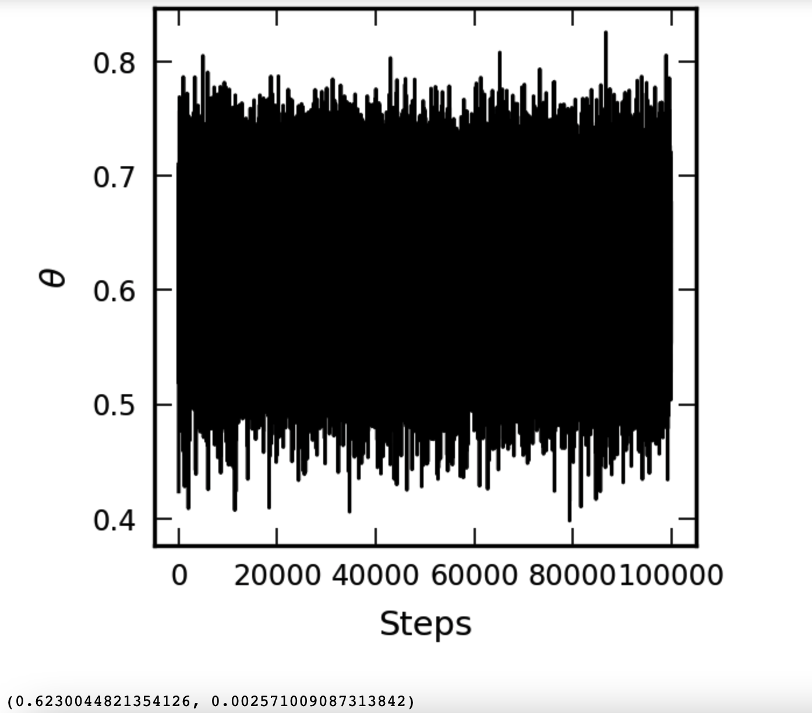  
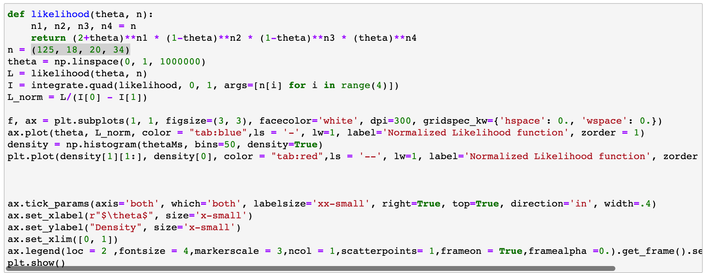  
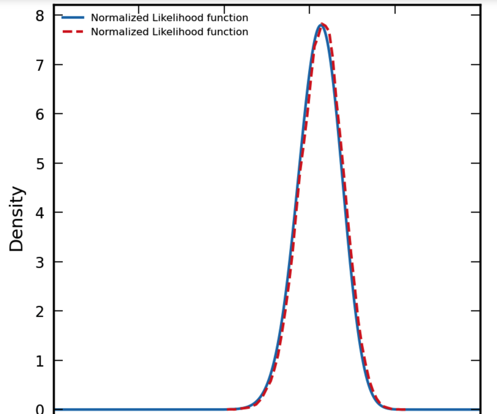  
  
## b.  

In the same way, for $(x_1, x_2, x_3, x_4) = (14, 0, 1, 5)$ with the same corresponding probability. Repeat the steps above.  
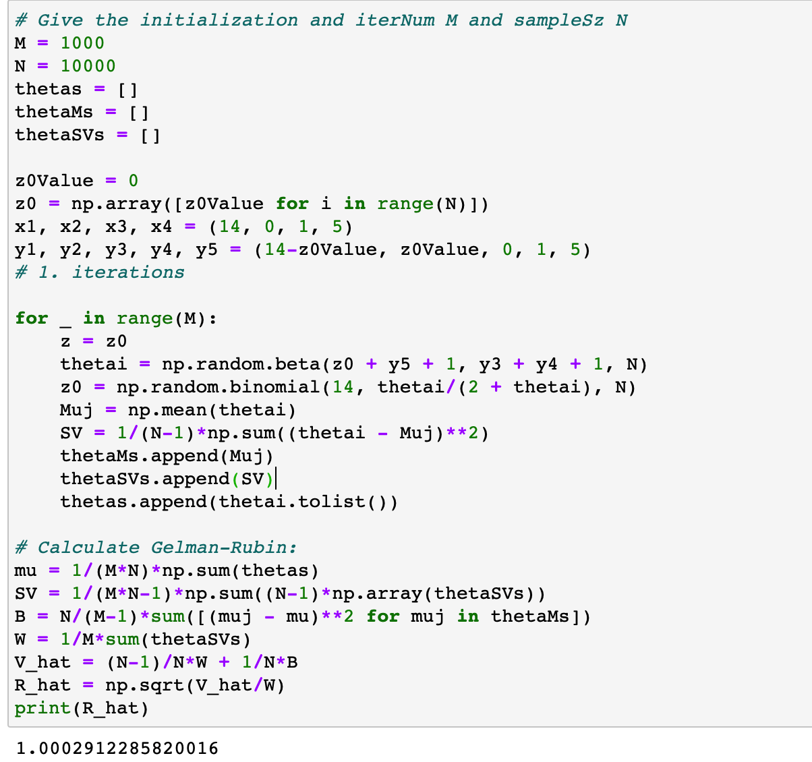  
After trying some other initialization, we can still find the similar results with a, which shows the convergence of the chains.  
  
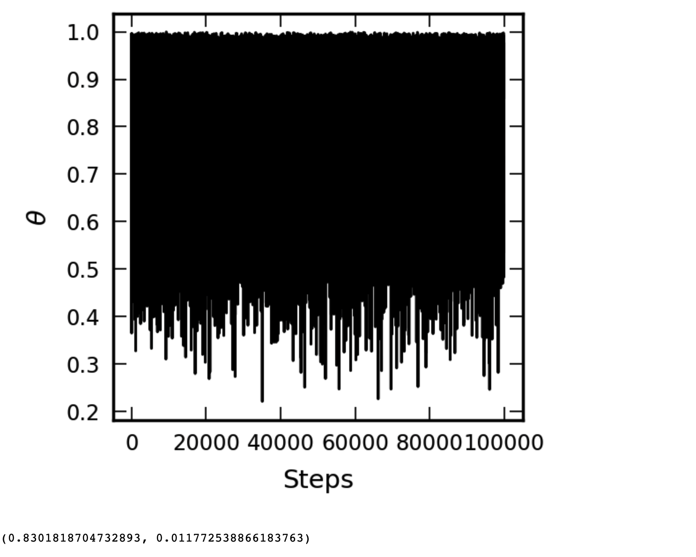  
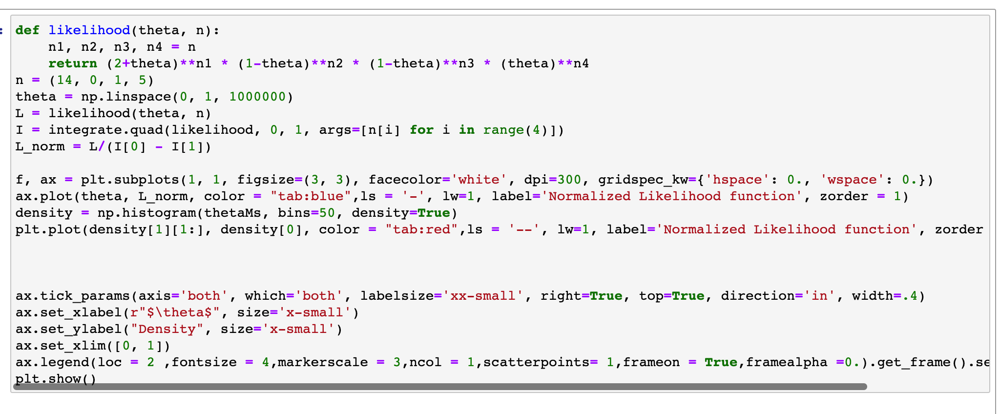  
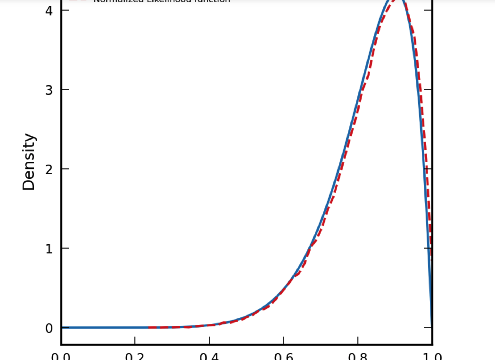  
We can use Gibbs sampler to get theta_i and find the convergence traces and use Gelman-Rubin method to check convergence after choosing M and N. We can find both situations will conver in the end and plot the normalized likelihood and simulation density above.  
  
# Question2  
## a  
### (1)  
  
For the Uniform on (0,1):  
  
```{r Question2}
k = 1
means1 <- c()
vars1 <- c()
set.seed(457)
N = 50000 
theta = vector(length = N) 
theta[1] = 0.5  
u = runif(N) 
for (i in 2:N) { 
  y = runif(1,0,1)
  p_accept = dmultinom(x=c(125,18,20,34),prob=c((2+y)/4,(1-y)/4,(1-y)/4,y/4))/
    dmultinom(x=c(125,18,20,34),prob=c((2+theta[i-1])/4,(1-theta[i-1])/4,(1-theta[i-1])/4,theta[i-1]/4))
  if (u[i] <= p_accept) { 
    theta[i] = y 
  } else { 
    theta[i] = theta[i-1] 
  } 
} 

df <- data.frame(theta)

f.like0<-function(x){(2+x)^125*(1-x)^38*x^34} 
c <- integrate(f.like0, 0, 1)$value

ggplot(df, aes(x = theta)) +
  geom_histogram(aes(y = after_stat(density)), binwidth = 0.01, color = "black", fill = "lightblue") +
  ylim(0, 9) +
  labs(x = "theta", y = "Density",title = "Uniform(0, 1)") +
  stat_function(fun = function(x) {
  1 / c * (2 + x)^125 * (1 - x)^38 * x^34
  }, color = "red")

ggplot(df, aes(x = 1:N, y = theta)) +
  geom_line(color = "black") +
  labs(x = "Steps", y = "theta",title = "Uniform(0, 1)")

means1[k] <- mean(theta)
vars1[k] <- var(theta)
means1
k = k + 1
```
  
### (2).  
Then for the Normal cenetered at the current point in the chain and standard deviation 0.1:  
  
```{r}
set.seed(457)
theta = vector(length = N) 
theta[1] = 0.5
u = runif(N) 
for (i in 2:N) {
  y = rnorm(1, theta[i-1], 0.01)
  if (0 <= y && y <= 1) {
    p_accept = dmultinom(x=c(125, 18, 20, 34), 
                         prob=c((2+y)/4, (1-y)/4, (1-y)/4, y/4)) / 
               dmultinom(x=c(125, 18, 20, 34), 
                         prob=c((2+theta[i-1])/4, (1-theta[i-1])/4, 
                               (1-theta[i-1])/4, theta[i-1]/4))
    if (u[i] < p_accept) {
      theta[i] = y
    } else {
      theta[i] = theta[i-1]
    }
  } else {
    p_accept = 1
    theta[i] = theta[i-1]
  }
}


df <- data.frame(theta)

f.like0<-function(x){(2+x)^125*(1-x)^38*x^34} 
c <- integrate(f.like0, 0, 1)$value

ggplot(df, aes(x = theta)) +
  geom_histogram(aes(y = after_stat(density)), binwidth = 0.01, color = "black", fill = "lightblue") +
  ylim(0, 9) +
  labs(x = "theta", y = "Density",title = "Normal(theta,0.01)") +
  stat_function(fun = function(x) {
  1 / c * (2 + x)^125 * (1 - x)^38 * x^34
  }, color = "red")


ggplot(df, aes(x = 1:N, y = theta)) +
  geom_line(color = "black") +
  labs(x = "Steps", y = "theta",title = "Normal(theta,0.01)")
means1[k] <- mean(theta)
vars1[k] <- var(theta)
k = k + 1
```
  
### (3).  
Then for the Normal with same mean as in (2) and standard deviation of 0.1:  
  
```{r}
set.seed(457)
theta[1] <- 0.5
u <- runif(N)

for (i in 2:N) {
  y <- rnorm(1, theta[i-1], 0.1)
  
  if (1 >= y && y >= 0) {
    p_accept <- dmultinom(x=c(125,18,20,34), prob=c((2+y)/4, (1-y)/4, (1-y)/4, y/4)) /
                dmultinom(x=c(125,18,20,34), prob=c((2+theta[i-1])/4, (1-theta[i-1])/4, (1-theta[i-1])/4, theta[i-1]/4))
    
    if (u[i] < p_accept) {
      theta[i] <- y
    } else {
      theta[i] <- theta[i-1]
    }
  } else {
    p_accept <- 1
    theta[i] <- theta[i-1]
  }
}

df <- data.frame(theta)

f.like0<-function(x){(2+x)^125*(1-x)^38*x^34} 
c <- integrate(f.like0, 0, 1)$value

ggplot(df, aes(x = theta)) +
  geom_histogram(aes(y = after_stat(density)), binwidth = 0.01, color = "black", fill = "lightblue") +
  ylim(0, 9) +
  labs(x = "theta", y = "Density",title = "Normal(theta,0.1)") +
  stat_function(fun = function(x) {
  1 / c * (2 + x)^125 * (1 - x)^38 * x^34
  }, color = "red")
ggplot(df, aes(x = 1:N, y = theta)) +
  geom_line(color = "black") +
  labs(x = "Steps", y = "theta",title = "Normal(theta,0.1)")

means1[k] <- mean(theta)
vars1[k] <- var(theta)
k = k + 1
```  
  
### (4).  
Then for the Normal with same mean as in (3) and standard deviation of 0.5:  
  
```{r}
set.seed(457)
theta <- numeric(N)
theta[1] <- 0.1
u <- runif(N)

for (i in 2:N) {
  y = rnorm(1,theta[i-1],0.5)
  
  if (1 >= y && y >= 0) {
    p_accept <- dmultinom(x=c(125,18,20,34), prob=c((2+y)/4, (1-y)/4, (1-y)/4, y/4)) /
                dmultinom(x=c(125,18,20,34), prob=c((2+theta[i-1])/4, (1-theta[i-1])/4, (1-theta[i-1])/4, theta[i-1]/4))
    
    if (u[i] < p_accept) {
      theta[i] <- y
    } else {
      theta[i] <- theta[i-1]
    }
  } else {
    p_accept <- 1
    theta[i] <- theta[i-1]
  }
}

df <- data.frame(theta)

f.like0<-function(x){(2+x)^125*(1-x)^38*x^34} 
c <- integrate(f.like0, 0, 1)$value

ggplot(df, aes(x = theta)) +
  geom_histogram(aes(y = after_stat(density)), binwidth = 0.01, color = "black", fill = "lightblue") +
  ylim(0, 9) +
  labs(x = "theta", y = "Density",title = "Normal(theta,0.5)") +
  stat_function(fun = function(x) {
  1 / c * (2 + x)^125 * (1 - x)^38 * x^34
  }, color = "red")
ggplot(df, aes(x = 1:N, y = theta)) +
  geom_line(color = "black") +
  labs(x = "Steps", y = "theta",title = "Normal(theta,0.5)")

means1[k] <- mean(theta)
vars1[k] <- var(theta)
k = k + 1
```  
  
### (5).  
Then for the Normal with same mean 0.4 and standard deviation of 0.1:  
  
```{r}
set.seed(457)
theta[1] <- 0.1
u <- runif(N)

for (i in 2:N) {
  y = rnorm(1,0.4,0.1)
  
  if (1 >= y && y >= 0) {
    p_accept <- dmultinom(x=c(125,18,20,34), prob=c((2+y)/4, (1-y)/4, (1-y)/4, y/4)) /
                dmultinom(x=c(125,18,20,34), prob=c((2+theta[i-1])/4, (1-theta[i-1])/4, (1-theta[i-1])/4, theta[i-1]/4))
    
    if (u[i] < p_accept) {
      theta[i] <- y
    } else {
      theta[i] <- theta[i-1]
    }
  } else {
    p_accept <- 1
    theta[i] <- theta[i-1]
  }
}

df <- data.frame(theta)
f.like0<-function(x){(2+x)^125*(1-x)^38*x^34} 
c <- integrate(f.like0, 0, 1)$value

ggplot(df, aes(x = theta)) +
  geom_histogram(aes(y = after_stat(density)), binwidth = 0.01, color = "black", fill = "lightblue") +
  ylim(0, 9) +
  labs(x = "theta", y = "Density",title = "Normal(0.4,0.1)") +
  stat_function(fun = function(x) {
  1 / c * (2 + x)^125 * (1 - x)^38 * x^34
  }, color = "red")

ggplot(df, aes(x = 1:N, y = theta)) +
  geom_line(color = "black") +
  labs(x = "Steps", y = "theta",title = "Normal(0.4,0.1)")

means1[k] <- mean(theta)
vars1[k] <- var(theta)
k = k + 1
```  
  
We can assess the convergence as the method used in Question 1 using the Gelman-Rubin method. From the results, former four methods converge well and fast but for the fifth chain, it does not converge well. In contrast, the case with std = 0.1, mean = $\theta$ converges fastes. I did not toss some intial values out. For the fifth chain, Metropolis or generalized Metropolis may not behave well.  
  
## b.  Repeat the process above for the data Y = (14, 0, 1, 5) and I get following results:  For the Uniform on (0,1):  
  
```{r}
set.seed(457)
k = 1
means2 <- c()
vars2 <- c()
N = 50000 
theta = vector(length = N) 
theta[1] = 0.5 
# uniform variable: u 
u = runif(N) 
for (i in 2:N) { 
  y = runif(1,0,1)
  p_accept = dmultinom(x=c(14,0,1,5),prob=c((2+y)/4,(1-y)/4,(1-y)/4,y/4))/
    dmultinom(x=c(14,0,1,5),prob=c((2+theta[i-1])/4,(1-theta[i-1])/4,(1-theta[i-1])/4,theta[i-1]/4))
  if (u[i] <= p_accept) { 
    theta[i] = y 
  } else { 
    theta[i] = theta[i-1] 
  } 
} 

df <- data.frame(theta)

f.like0<-function(x){(2+x)^14*(1-x)^1*x^5} 
c <- integrate(f.like0, 0, 1)$value


ggplot(df, aes(x = theta)) +
  geom_histogram(aes(y = after_stat(density)), binwidth = 0.01, color = "black", fill = "lightblue") +
  ylim(0, 9) +
  labs(x = "theta", y = "Density",title = "Uniform(0, 1)")+
  stat_function(fun = function(x){1/c*(2+x)^14*(1-x)^1*x^5}, color = "red")
  
ggplot(df, aes(x = 1:N, y = theta)) +
  geom_line(color = "black") +
  labs(x = "Steps", y = "theta",title = "Uniform(0, 1)")

means2[k] <- mean(theta)
vars2[k] <- var(theta)
k = k + 1
```  
  
### (2).  
Then for the Normal cenetered at the current point in the chain and standard deviation 0.1:  
  
```{r}
set.seed(457)
theta = vector(length = N) 
theta[1] = 0.5
u = runif(N) 
for (i in 2:N) {
  y = rnorm(1, theta[i-1], 0.01)
  if (0 <= y && y <= 1) {
    p_accept = dmultinom(x=c(14,0,1,5), 
                         prob=c((2+y)/4, (1-y)/4, (1-y)/4, y/4)) / 
               dmultinom(x=c(14,0,1,5), 
                         prob=c((2+theta[i-1])/4, (1-theta[i-1])/4, 
                               (1-theta[i-1])/4, theta[i-1]/4))
    if (u[i] < p_accept) {
      theta[i] = y
    } else {
      theta[i] = theta[i-1]
    }
  } else {
    p_accept = 1
    theta[i] = theta[i-1]
  }
}


df <- data.frame(theta)

f.like0<-function(x){(2+x)^14*(1-x)^1*x^5} 
c <- integrate(f.like0, 0, 1)$value


ggplot(df, aes(x = theta)) +
  geom_histogram(aes(y = after_stat(density)), binwidth = 0.01, color = "black", fill = "lightblue") +
  ylim(0, 9) +
  labs(x = "theta", y = "Density",title = "Normal(theta,0.01)") +
 stat_function(fun = function(x){1/c*(2+x)^14*(1-x)^1*x^5}, color = "red")


ggplot(df, aes(x = 1:N, y = theta)) +
  geom_line(color = "black") +
  labs(x = "Steps", y = "theta",title = "Normal(theta,0.01)")

means2[k] <- mean(theta)
vars2[k] <- var(theta)
k = k + 1
```  
  
### (3).  
Then for the Normal with same mean as in (2) and standard deviation of 0.1:  
  
```{r}

theta[1] <- 0.5
u <- runif(N)

for (i in 2:N) {
  y <- rnorm(1, theta[i-1], 0.1)
  
  if (1 >= y && y >= 0) {
    p_accept <- dmultinom(x=c(14,0,1,5), prob=c((2+y)/4, (1-y)/4, (1-y)/4, y/4)) /
                dmultinom(x=c(14,0,1,5), prob=c((2+theta[i-1])/4, (1-theta[i-1])/4, (1-theta[i-1])/4, theta[i-1]/4))
    
    if (u[i] < p_accept) {
      theta[i] <- y
    } else {
      theta[i] <- theta[i-1]
    }
  } else {
    p_accept <- 1
    theta[i] <- theta[i-1]
  }
}

df <- data.frame(theta)

f.like0<-function(x){(2+x)^14*(1-x)^1*x^5} 
c <- integrate(f.like0, 0, 1)$value
f.like.norm<-function(x){1/c*(2+x)^14*(1-x)^1*x^5}

ggplot(df, aes(x = theta)) +
  geom_histogram(aes(y = after_stat(density)), binwidth = 0.01, color = "black", fill = "lightblue") +
  ylim(0, 9) +
  labs(x = "theta", y = "Density",title = "Normal(theta,0.1)") +
  stat_function(fun = function(x){1/c*(2+x)^14*(1-x)^1*x^5}, color = "red")

ggplot(df, aes(x = 1:N, y = theta)) +
  geom_line(color = "black") +
  labs(x = "Steps", y = "theta",title = "Normal(theta,0.1)")

means2[k] <- mean(theta)
vars2[k] <- var(theta)
k = k + 1
```  
  
### (4).  
Then for the Normal with same mean as in (3) and standard deviation of 0.5:  
  
```{r}
theta <- numeric(N)
theta[1] <- 0.1
u <- runif(N)

for (i in 2:N) {
  y = rnorm(1,theta[i-1],0.5)
  
  if (1 >= y && y >= 0) {
    p_accept <- dmultinom(x=c(14,0,1,5), prob=c((2+y)/4, (1-y)/4, (1-y)/4, y/4)) /
                dmultinom(x=c(14,0,1,5), prob=c((2+theta[i-1])/4, (1-theta[i-1])/4, (1-theta[i-1])/4, theta[i-1]/4))
    
    if (u[i] < p_accept) {
      theta[i] <- y
    } else {
      theta[i] <- theta[i-1]
    }
  } else {
    p_accept <- 1
    theta[i] <- theta[i-1]
  }
}

df <- data.frame(theta)
f.like0<-function(x){(2+x)^14*(1-x)^1*x^5} 
c <- integrate(f.like0, 0, 1)$value

ggplot(df, aes(x = theta)) +
  geom_histogram(aes(y = after_stat(density)), binwidth = 0.01, color = "black", fill = "lightblue") +
  ylim(0, 9) +
  labs(x = "theta", y = "Density",title = "Normal(theta,0.5)") +
   stat_function(fun = function(x){1/c*(2+x)^14*(1-x)^1*x^5}, color = "red")
ggplot(df, aes(x = 1:N, y = theta)) +
  geom_line(color = "black") +
  labs(x = "Steps", y = "theta",title = "Normal(theta,0.5)")

means2[k] <- mean(theta)
vars2[k] <- var(theta)
k = k + 1
```  
  
### (5).  
Then for the Normal with same mean 0.4 and standard deviation of 0.1:  
  
```{r}
theta[1] <- 0.1
u <- runif(N)

for (i in 2:N) {
  y = rnorm(1,0.4,0.1)
  
  if (1 >= y && y >= 0) {
    p_accept <- dmultinom(x=c(14,0,1,5), prob=c((2+y)/4, (1-y)/4, (1-y)/4, y/4)) /
                dmultinom(x=c(14,0,1,5), prob=c((2+theta[i-1])/4, (1-theta[i-1])/4, (1-theta[i-1])/4, theta[i-1]/4))
    
    if (u[i] < p_accept) {
      theta[i] <- y
    } else {
      theta[i] <- theta[i-1]
    }
  } else {
    p_accept <- 1
    theta[i] <- theta[i-1]
  }
}

df <- data.frame(theta)
f.like0<-function(x){(2+x)^14*(1-x)^1*x^5} 
c <- integrate(f.like0, 0, 1)$value

ggplot(df, aes(x = theta)) +
  geom_histogram(aes(y = after_stat(density)), binwidth = 0.01, color = "black", fill = "lightblue") +
  ylim(0, 9) + xlim(0,1) +
  labs(x = "theta", y = "Density",title = "Normal(0.4,0.1)") +
  stat_function(fun = function(x){1/c*(2+x)^14*(1-x)^1*x^5}, color = "red")

ggplot(df, aes(x = 1:N, y = theta)) +
  geom_line(color = "black") + 
  labs(x = "Steps", y = "theta",title = "Normal(0.4,0.1)")

means2[k] <- mean(theta)
vars2[k] <- var(theta)
k = k + 1
```  
  
Similarly, we can assess the convergence as the method used in Question 1 using the Gelman-Rubin method. From the results, former four methods converge well but for the fifth chain, it does not converge well. However, for the second chain, it shows the problem of slow convergence.  
  
## 3.  
  
```{r}
print("Following the order of Uniform(0,1), Normal(theta, 0.01), , Normal(theta, 0.1), , Normal(theta, 0.5), , Normal(0.4, 0.1)")
print("The means of the first dataset:")
means1
print("The variances of the first dataset:")
vars1
print("The means of the second dataset:")
means2
print("The variances of the seconnd dataset:")
vars2
```  
  
# Question 3
## a.  
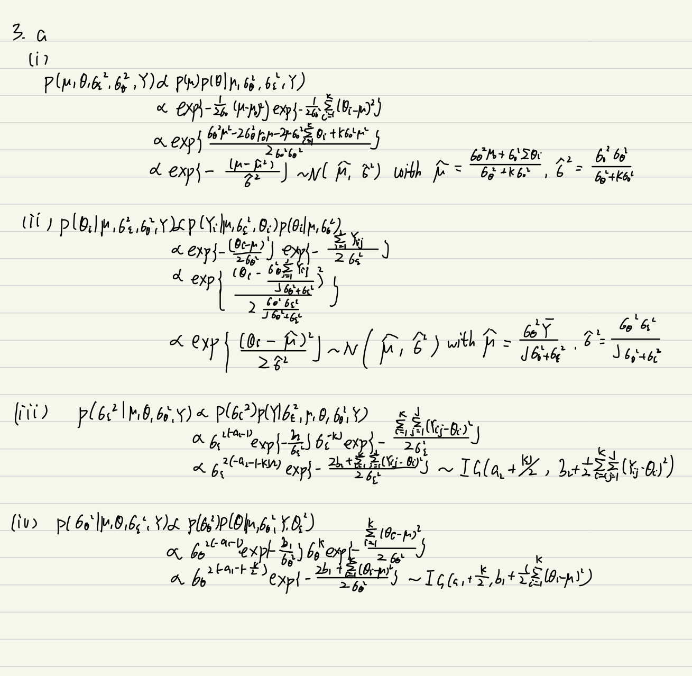  
  
## b.  
```{r Question 3}
set.seed(457)
data = c(7.298, 3.846, 2.434, 9.566, 7.99, 5.22, 6.556, 0.608, 11.788, -0.892, 0.11, 10.386, 13.434, 5.51, 8.166, 2.212, 4.852, 7.092, 9.288, 4.98, 0.282, 9.014, 4.458, 9.446, 7.198, 1.722, 4.782, 8.106, 0.758, 3.758)
y <- matrix(data, ncol = 6)
yi <- apply(y,2,mean)
s_yij <- sum(apply(y, 2, function(col) sum((col - mean(col))^2)))
mu <- 4
theta <- matrix(NA,ncol=6,nrow=75001)
theta[1,] <- c(6,5,7,5,6,4)
sigma_e <- 1
sigma_t <- 1
for(i in 2:75001) {
  mu[i] <- rnorm(1,
                 10^12 * sum(theta[i-1,]) / (sigma_t[i-1] + 6*10^12),
                 sigma_t[i-1]*10^12 / (sigma_t[i-1] + 6*10^12))

  theta[i,] <- rnorm(6,
                     5*sigma_t[i-1] / (5*sigma_t[i-1] + sigma_e[i-1]) * yi + 
                     sigma_e[i-1] / (5*sigma_t[i-1] + sigma_e[i-1]) * mu[i-1],
                     sqrt(sigma_t[i-1] * sigma_e[i-1] / (5*sigma_t[i-1] + sigma_e[i-1])))
  
  sigma_e[i] <- 1 / rgamma(1, 30 / 2, s_yij / 2)
  sigma_t[i] <- 1 / rgamma(1, 4, 1 + sum((theta[i-1,] - mean(theta[i-1,]))^2) / 2)
}
df <- data.frame(mu)
ggplot(df, aes(x = 1:length(mu), y = mu)) +
  geom_line(color = "black") +
  xlab("j") +
  ylab(expression(mu))

df <- data.frame(sigma_e)
ggplot(df, aes(x = 1:length(sigma_e), y = sigma_e)) +
  geom_line(color = "black") +
  xlab("j") +
  ylab(expression(sigma[epsilon]^2))

df <- data.frame(sigma_t)
ggplot(df, aes(x = 1:length(sigma_t), y = sigma_t)) +
  geom_line(color = "black") +
  xlab("j") +
  ylab(expression(sigma[theta]^2))

df <- data.frame(theta = theta[,1])
ggplot(df, aes(x = 1:length(theta), y = theta)) +
  geom_line(color = "black") +
  xlab("j") +
  ylab(expression(theta[1]))

df <- data.frame(theta = theta[, 2])
ggplot(df, aes(x = 1:length(theta), y = theta)) +
  geom_line(color = "black") +
  xlab("j") +
  ylab(expression(theta[2]))

df <- data.frame(theta = theta[,3], j = 1:length(theta[,3]))
ggplot(df, aes(x = j, y = theta)) +
  geom_line(color = "black") +
  xlab("j") +
  ylab(expression(theta[3]))

df <- data.frame(theta = theta[,4], j = 1:length(theta[,4]))
ggplot(df, aes(x = j, y = theta)) +
  geom_line(color = "black") +
  xlab("j") +
  ylab(expression(theta[4]))

df <- data.frame(theta = theta[,5], j = 1:length(theta[,5]))
ggplot(df, aes(x = j, y = theta)) +
  geom_line(color = "black") +
  xlab("j") +
  ylab(expression(theta[5]))

df <- data.frame(theta = theta[,6], j = 1:length(theta[,6]))
ggplot(df, aes(x = j, y = theta)) +
  geom_line(color = "black") +
  xlab("j") +
  ylab(expression(theta[6]))


```  
  
## c.  
  
```{r}
for (i in 2:75001) {
  mu[i] <- rnorm(1,
                  10^12 * sum(theta[i - 1, ]) / (sigma_t[i - 1] + 6 * 10^12),
                  sigma_t[i - 1] * 10^12 / (sigma_t[i - 1] + 6 * 10^12))
  theta[i, ] <- rnorm(6,
                       5 * sigma_t[i - 1] / (5 * sigma_t[i - 1] + sigma_e[i - 1]) * yi +
                       sigma_e[i - 1] / (5 * sigma_t[i - 1] + sigma_e[i - 1]) * mu[i - 1],
                       sigma_t[i - 1] * sigma_e[i - 1] / (5 * sigma_t[i - 1] + sigma_e[i - 1]))
  sigma_e[i] <- 1 / rgamma(1, 30 / 2, s_yij / 2)
  sigma_t[i] <- 1 / rgamma(1, 3, sum((theta[i - 1, ] - mean(theta[i - 1, ]))^2) / 2)
}

df1 <- data.frame(mu = mu)
plot1 <- ggplot(df1, aes(x = 1:length(mu), y = mu)) +
  geom_line(color = "black") +
  xlab("j") +
  ylab(expression(mu))


df2 <- data.frame(sigma_e = sigma_e)
plot2 <- ggplot(df2, aes(x = 1:length(sigma_e), y = sigma_e)) +
  geom_line(color = "black") +
  xlab("j") +
  ylab(expression(sigma[epsilon]^2))

df3 <- data.frame(sigma_t = sigma_t)
plot3 <- ggplot(df3, aes(x = 1:length(sigma_t), y = sigma_t)) +
  geom_line(color = "black") +
  xlab("j") +
  ylab(expression(sigma[theta]^2))


df <- data.frame(theta = theta[,1])

ggplot(df, aes(x = 1:length(theta), y = theta)) +
  geom_line(color = "black") +
  xlab("j") +
  ylab(expression(theta[1]))

df <- data.frame(theta = theta[-1, 2])
ggplot(df, aes(x = 1:length(theta), y = theta)) +
  geom_line(color = "black") +
  xlab("j") +
  ylab(expression(theta[2]))

df <- data.frame(theta = theta[,3], j = 1:length(theta[,3]))
ggplot(df, aes(x = j, y = theta)) +
  geom_line(color = "black") +
  xlab("j") +
  ylab(expression(theta[3]))  
  
df <- data.frame(theta = theta[,4], j = 1:length(theta[,4]))
ggplot(df, aes(x = j, y = theta)) +
  geom_line(color = "black") +
  xlab("j") +
  ylab(expression(theta[4]))  

df <- data.frame(theta = theta[,5], j = 1:length(theta[,5]))
ggplot(df, aes(x = j, y = theta)) +
  geom_line(color = "black") +
  xlab("j") +
  ylab(expression(theta[5]))  

df <- data.frame(theta = theta[,6], j = 1:length(theta[,6]))
ggplot(df, aes(x = j, y = theta)) +
  geom_line(color = "black") +
  xlab("j") +
  ylab(expression(theta[6]))


```  
  
It violates Hobert-Casella conditions. Because of the Lack for prior information, all prior distributions are chosen to be uninformative, which leads to the disconvergence of the chains.  
  
  
# Question 5  
## a.  
  
```{r}
set.seed(457)
B <- 3
x <- 2 # initialize value of x 
y <- 2 # initialize value of y 
n <- 10000
for (i in 1:n) {
 ux <- runif(1)
 x[i+1] <- -1/y[i] * log(1 - (1-exp(-y[i]*B))*ux)
 uy <- runif(1)
 y[i+1] <- -1/x[i+1] * log(1 - (1-exp(-x[i+1]*B))*uy)
}

df <- data.frame(x = x)
ggplot(df, aes(x = 1:length(x), y = x)) +
  geom_line(color = "black") +
  xlab("interations") +
  ylab(expression(x))

df <- data.frame(x = y)
ggplot(df, aes(x = 1:length(y), y = y)) +
  geom_line(color = "black") +
  xlab("interations") +
  ylab(expression(y))  

x <- x[-(1:1001)] 
y <- y[-(1:1001)] 
par(mar = c(4, 5, 1, 2))
hist(x, 50, freq = FALSE, ylim = c(0, 1.2), main = '')
fx <- function(x) (1 - exp(-B*x)) / x
C <- integrate(fx, 0, B)[[1]]
x <- sort(x)
lines(x, fx(x)/C, col = 'red', lwd = 2)
```  
Evaluate the convergence using Galmen-Rubin method with R_hat close to 1 and less than 1.1, which means it converges well.  
  
## b.  
```{r}
f <- function(x){ (1-exp(-3*x))/x
}
const <- integrate(f,0,3)$value
f <- function(x) (1-exp(-3*x))/(x*const)
hist(x,freq=F)
curve(f,add=T)
```  
## c.  
```{r}
x <- 1
y <- 1
for(i in 2:10001){
  x[i] <- rexp(1,y[i-1])
  y[i] <- rexp(1,x[i-1])
}
x <- x[-c(1:1001)]
y <- y[-c(1:1001)]
plot(x,type="l")
plot(y,type="l")
hist(x,freq=F)
```  
  
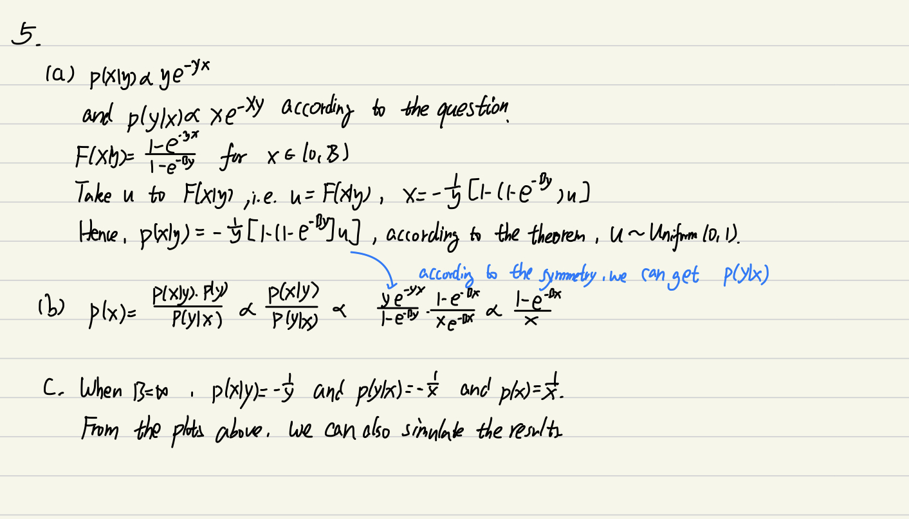  
